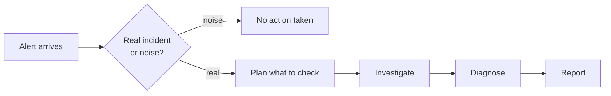

Think of OpenSRE as an on-call engineer who never sleeps. It follows the same
instincts a good on-call engineer would: get paged, decide whether it's
actually worth waking up for, check the obvious dashboards first, take notes
as it goes, stop once it has an answer (or has run out of useful things to
check), and write it up clearly for whoever reads it next.

## The six stages

<Steps>
  <Step title="See what's connected">
    Before looking at anything alert-specific, OpenSRE checks which of your
    monitoring and infrastructure tools are actually connected — Grafana,
    Datadog, EKS, and whatever else you've set up. This defines the universe
    of things it's allowed to check for this investigation.
  </Step>
  <Step title="Decide if it's worth investigating">
    OpenSRE reads the incoming alert and classifies it: a real incident, or
    noise (a greeting, a "thanks," a reply in an already-closed thread)?
    Genuine alerts proceed — including informational or "all clear"
    notifications, since those still carry signal. Chit-chat is ignored and
    nothing further happens.
  </Step>
  <Step title="Sketch a plan">
    Rather than poking around at random, OpenSRE picks the handful of tools
    most likely to explain *this specific* alert — matched by source (a
    Grafana alert starts with Grafana queries, an EKS alert starts with pod
    and cluster tools) and ranked by relevance. This keeps the investigation
    focused instead of firing off every tool it has access to.
  </Step>
  <Step title="Investigate">
    This is where the real work happens. OpenSRE works through its plan one
    step at a time: run a check, look at what came back, decide what to check
    next. It keeps a running memory of everything it's found, so each new
    step builds on the last instead of starting from scratch.

    A few habits keep this efficient:

    - It won't run the exact same check twice — if it already has that
      answer, it reuses it instead of asking again.
    - If it finds itself going in circles without learning anything new, it
      stops and writes up what it already has rather than spinning forever.
    - There's a hard ceiling on how long a single investigation can run, so
      one stubborn incident can never run away with unbounded time or cost.
  </Step>
  <Step title="Diagnose">
    Once OpenSRE has enough evidence — or has run out of useful things to
    check — it turns its findings into a structured diagnosis: what
    happened, the chain of cause and effect, which claims are backed by
    evidence versus still unconfirmed, and concrete remediation steps. It
    also attaches a confidence score, so you know how much to trust the
    conclusion at a glance.
  </Step>
  <Step title="Report">
    Finally, OpenSRE delivers the result however you've configured it — a
    Slack message in the incident channel, a GitLab comment, or local files
    you can read directly. See
    [Investigations overview](/investigation-overview) for what these look
    like and how to run one yourself.
  </Step>
</Steps>

## Why it doesn't lose the thread on long investigations

A thorny incident can mean touching a dozen tools and collecting a lot of
evidence. OpenSRE actively manages what it's holding onto in its working
memory so that early findings don't get pushed out by later ones — the same
reason a good engineer keeps a running incident doc instead of trying to hold
every detail in their head. If a long investigation starts accumulating more
than it can usefully reason about at once, OpenSRE trims the least useful
parts rather than letting the most important early evidence quietly fall out
of view.

<Note>
  You don't need to configure any of this — tool selection, note-keeping, and
  the stop conditions above all happen automatically. This page just explains
  what's going on behind the spinner.
</Note>

## Related pages

- [Investigations overview](/investigation-overview) — how to start an
  investigation and where to find the output.
- [Interactive Shell Commands](/interactive-shell-commands) — the slash
  commands available while an investigation runs.
- [Closed-loop learning](/closed-loop-learning) — how OpenSRE improves future
  investigations from past outcomes.
